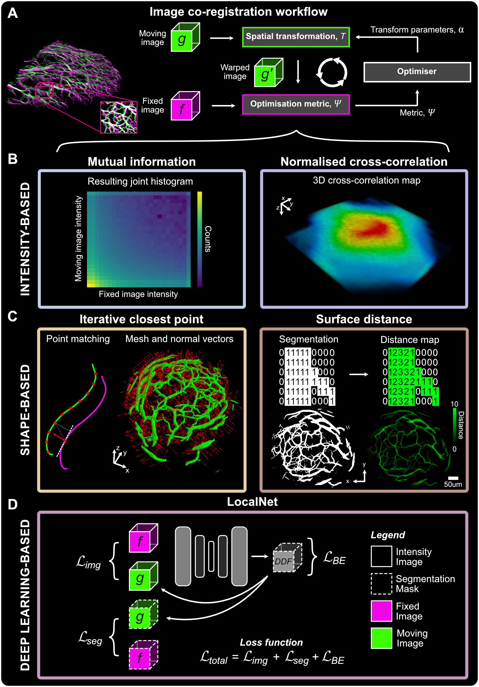

# coregistration-longitudinal-pai-mesoscopy

This repository contains the code for preprocessing, co-registering , and assessing the co-registration performance of methods applied to mesoscopic photoacoustic imaging (PAI) data, presented in the study by Lefebvre TL et al. (Lefebvre TL et al. Performance evaluation of traditional and deep learning-based image co-registration methods in photoacoustic mesoscopy of the vasculature. 2024.). Three categories of co-registration techniques are tested:
* Intensity-based co-registration (using joint histogram mutual information or normalized cross-correlation as an optimization metric for affine image co-registration)
* Shape-based co-registration (using the point-to-plane iterative closest point algorithm or normalized cross-correlation on distance-transformed segmentations for affine image co-registration)
* Deep learning-based segmentation (using dual-input LocalNet for learned deformable image co-registration)

This work is largerly based on contributions and Python packages developed by others and reported previously, mainly:
* `SimpleITK` (Lowekamp et al. The Design of SimpleITK. Frontiers in Neuroinformatics. 2013 Dec 30;7:45)
* `Open3D` (Zhou et al. Open3D: A Modern Library for 3D Data Processing. arXiv. 2018. arXiv:1801.09847)
* `MONAI` (Cardoso et al. MONAI: An open-source framework for deep learning in healthcare. arXiv. 2022. arXiv:2211.02701)

